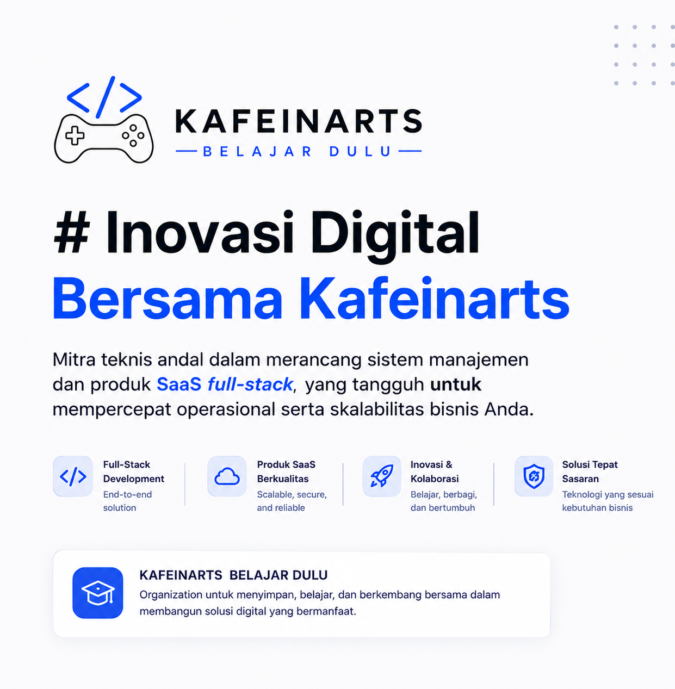

<div align="center">


<br><br>



<br><br>

<p align="center">
  
  <a href="https://github.com/Kafeinarts">
    
  </a>
</p>

<br><br>


<br><br>

<h2 align="center">
  📊&nbsp;&nbsp;<b>GitHub Stats</b>
</h2>

<div align="center">


<br><br>


</div>

<br><br>

<h2 align="center">
  🚀&nbsp;&nbsp;<b>About Kafeinarts</b>
</h2>

<p align="center">
  Kafeinarts adalah wadah bagi tim untuk belajar, berdiskusi,
  berbagi pengetahuan, bereksperimen, dan berkembang bersama
  dalam dunia teknologi dan pemrograman.
</p>

<p align="center">
  Organization ini digunakan untuk menampung berbagai repository,
  project, latihan, eksperimen, serta hasil kolaborasi tim Kafeinarts.
</p>

<p align="center">
  Kami percaya bahwa perjalanan di dunia teknologi dimulai
  dari langkah-langkah sederhana.
</p>

<p align="center">
  <b>Satu baris kode.</b><br>
  <b>Satu error.</b><br>
  <b>Satu project.</b><br>
  <br>
  Kemudian terus belajar, membangun, dan berkembang bersama. 🚀
</p>

<br>

<p align="center">
  <b>Learn • Build • Collaborate • Grow</b>
</p>

<br><br>


<br><br>

<h2 align="center">
  📚&nbsp;&nbsp;<b>What We Do</b>
</h2>

<div align="center">

|        🚀 Learn        |     💻 Build      |     🤝 Collaborate      |      🌱 Grow       |
| :--------------------: | :---------------: | :---------------------: | :----------------: |
| Belajar teknologi baru | Membangun project | Berkolaborasi dalam tim | Berkembang bersama |

</div>

<br><br>


<br><br>

<h2 align="center">
  📂&nbsp;&nbsp;<b>Our Repositories</b>
</h2>

<p align="center">
  Organization ini menjadi tempat untuk menyimpan berbagai
  project dan perjalanan belajar tim Kafeinarts.
</p>

<div align="center">

```text
📁 Learning Projects
   └── Repository untuk latihan dan eksplorasi teknologi

📁 Team Projects
   └── Project yang dibangun bersama oleh tim

📁 Experimental Projects
   └── Eksperimen, prototype, dan proof of concept

📁 Open Source
   └── Project yang dapat dipelajari dan dikembangkan bersama

📁 Personal Contributions
   └── Project dan kontribusi dari anggota Kafeinarts
```

</div>

<br><br>


<br><br>

<h2 align="center">
  🛠️&nbsp;&nbsp;<b>Technologies We Explore</b>
</h2>

<p align="center">


</p>

<br><br>


<br><br>


<br><br>

<h2 align="center">
  ☕&nbsp;&nbsp;<b>Our Philosophy</b>
</h2>

<div align="center">

```text
Belajar tidak harus langsung jago.

Tidak apa-apa jika masih sering error.
Tidak apa-apa jika masih bingung.
Tidak apa-apa jika project pertama belum sempurna.

Yang penting...

Terus belajar.
Terus mencoba.
Terus membangun.

Karena setiap developer hebat
juga pernah memulai dari "Hello World". 🚀
```

</div>

<br><br>

<h2 align="center">
  🤝&nbsp;&nbsp;<b>Let's Learn Together!</b>
</h2>

<p align="center">

Kafeinarts adalah tempat untuk belajar, membangun,
berbagi, dan berkembang bersama.

<br><br>

<strong>☕ KAFEINARTS</strong>

<br><br>

<sub>Learn • Build • Collaborate • Grow 🚀</sub>

</p>

<br>

<p align="center">


</p>

</div>
